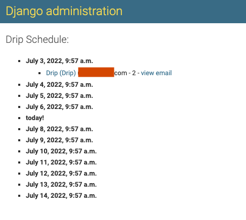
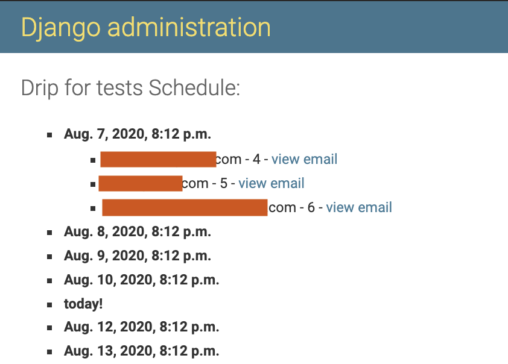

Features
=============

If you haven't, create a superuser with the `Django createsuperuser command <https://docs.djangoproject.com/en/3.0/intro/tutorial02/#creating-an-admin-user>`_. Login with the admin user, and select ``Sequences`` to manage them. You will be able to:

- View created sequences.
- Create a new sequence.
- Select and delete sequences.

Now you can also manage campaigns, select ``Campaigns`` to manage them. You will be able to:
- View created campaigns.
- Create a new campaign.
- Select and delete campaign.

Create Campaign
---------------
Click on the ``ADD CAMPAIGNS +`` button to create a new Campaign. In the creation you need to define the email that you want to send, the campaign the Sequence belong to and the queryset for the users that will receive it. To see more details, :ref:`click here <create-campaign>`.

View timeline of a Campaign
---------------------------

In the django admin, you can select a campaign and then click on the ``VIEW TIMELINE`` button to view the emails expected to be sent with the corresponding receivers grouped by the Sequence and with a link to the email and to the Sequence itself:

Create Sequence
-----------
Click on the ``ADD SEQUENCE +`` button to create a new Sequence. In the creation you need to define the email that you want to send, the campaign the Sequence belong to and the queryset for the users that will receive it. To see more details, :ref:`click here <create-sequence>`.

View timeline of a Sequence
-----------------------

In the django admin, you can select a sequence and then click on the ``VIEW TIMELINE`` button to view the emails expected to be sent with the corresponding receivers:

Message class
-------------

By default, Django Sequence creates and sends messages that are instances of Django’s ``EmailMultiAlternatives`` class.
If you want to customize in any way the message that is created and sent, you can do that by creating a subclass of ``EmailMessage`` and overriding any method that you want to behave differently.
For example:

.. code-block:: python

    from django.core.mail import EmailMessage
    from email_sequences.sequences import SequenceMessage

    class PlainSequenceEmail(SequenceMessage):

        @property
        def message(self):
            if not self._message:
                email = EmailMessage(self.subject, self.plain, self.from_email, [self.user.email])
                self._message = email
            return self._message

In that example, ``PlainSequenceEmail`` overrides the message property of the base ``SequenceMessage`` class to create a simple
``EmailMessage`` instance instead of an ``EmailMultiAlternatives`` instance.

In order to be able to specify that your custom message class should be used for a sequence, you need to configure it in the ``SEQUENCE_MESSAGE_CLASSES`` setting:

.. code-block:: python

    SEQUENCE_MESSAGE_CLASSES = {
        'plain': 'myproj.email.PlainSequenceEmail',
    }

This will allow you to choose in the admin, for each sequence, whether the ``default`` (``SequenceMessage``) or ``plain`` message class should be used for generating and sending the messages to users.

Send Sequences
----------

To send the created and enabled Sequences, run the command:

.. code-block:: python

    python manage.py send_sequences

You can use cron to schedule the sequences.

Unsubscribe users from emails
-----------------------------

If you need to unsubscribe users from the emails please add the following key ``SEQUENCE_UNSUBSCRIBE_USERS``set as ``True`` in the settings file.

We support unsubscribing from ``Sequence``, ``Campaign``, and also all emails (all emails sent by this library).

To see more details about changes in Sequence create, :ref:`click here <create-sequence>`.

Another config is needed here, please add sequence urls:

.. code-block:: python

    urlpatterns = [
        ...,
        path('sequence_unsubscribe/', include('email_sequences.urls'))
    ]

This configuration will enable 3 views (one for every type of unsubscription) with some dump HTML.

.. code-block:: python

    class UnsubscribeSequenceView(TemplateView):
        template_name = "email_sequences/unsubscribe_sequence.html"
        invalid_template_name = "email_sequences/unsubscribe_sequence_invalid.html"
        success_template_name = "email_sequences/unsubscribe_sequence_success.html"
        ...
    
    class UnsubscribeCampaignView(TemplateView):
        template_name = "email_sequences/unsubscribe_campaign.html"
        invalid_template_name = "email_sequences/unsubscribe_campaign_invalid.html"
        success_template_name = "email_sequences/unsubscribe_campaign_success.html"
        ...
    
    class UnsubscribeView(TemplateView):
        template_name = "email_sequences/unsubscribe_general.html"
        invalid_template_name = "email_sequences/unsubscribe_general_invalid.html"
        success_template_name = "email_sequences/unsubscribe_general_success.html"
        ...

These dump views will be useful for development, if you wish to customize the HTML, please follow this example:

.. code-block:: python

    from email_sequences.views import UnsubscribeView

    class CustomUnsubscribeView(UnsubscribeView):
        template_name = "custom_template.html"
        invalid_template_name = "invalid_custom_template.html"
        success_template_name = "sucess_custom_template.html"

And then instead of adding the sequence urls add the views you customize as the following:

.. code-block:: python

    from django.urls import re_path

    urlpatterns = [
        ...,
        re_path(
            r"^app/(?P<uidb64>\w+)/(?P<token>[\w-]+)/$",
            CustomUnsubscribeView.as_view(),
            name="unsubscribe_app",
        ),
    ]

Take a look in ``email_sequences.urls`` file to understand how urls are build for all 3 views.
IMPORTANT: Please keep the views ``name`` with the same values.
